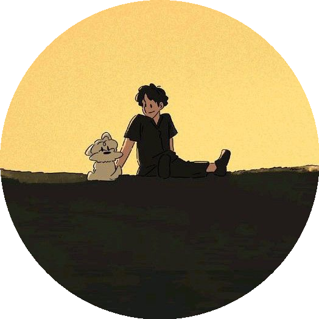

# ✌️ VarunHQ 😉


  <p align="center">
  
</p>

<p align="center">
  
</p>


---

## 🧬 Identity

> Crafting **games, apps, and web experiences** that feel fast, clean, and futuristic.  
> **Rule:** If it exists, redesign it. If it doesn’t, invent it.  
> **Signature:** Nothing here should feel familiar.

- 🧑‍💻 **Name:** Varun  
- ✅ **Alias:** VarunHQ  
- ⚡ **Focus:** Performance + Design + Originality  
- 🧩 **Edge:** Breaking patterns people don’t even notice exist  

---

## 🧠 Tech DNA

<p align="center">
  
</p>

<p align="center">
  <b>+ Terminal ⚡ + Routine 🔁</b>
</p>

---

## 📊 Neural Activity

<p align="center">
  
</p>

---

## 🧩 Signature Projects

> Not built to fit in — built to redefine.

- 🚀 **Doodle Dash** — drawing apps for kids  
- 🎮 **[Working on (a game)](#)** — mechanics that feel new, not repeated  
- 🌐 **[A big project is coming soon](#)** — will notify!

---

## ⚙️ Core Philosophy

Simplicity > Complexity<br>
Performance > Bloat<br>
Design > Noise<br>
Originality > Everything<br><br>
🧪 Current Focus<br><br>
🤖 AI-powered systems<br>
🎮 Advanced game mechanics<br>
⚡ Ultra-fast UI/UX<br><br>
🌐 Connect<br><br>
<p align="center"> <a href="https://github.com/VarunHQ">  </a> </p>
<p align="center">
  
 </p> <p align="center"> <b>i love myself💗</b> </p> ```
